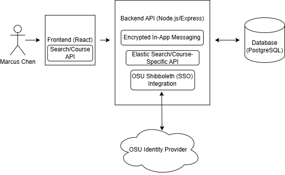

# Buckeye-Marketplace
## Feature Prioritization & Persona Mapping

The following features have been prioritized based on the needs of our primary persona, **Marcus Chen**. Marcus is a busy engineering student who values security, privacy, and efficiency.

### Phase 1: Launch (MVP - Critical Priority)
*These features address Marcus's core pain points regarding scams and privacy.*

| Feature | Issue # | Persona Justification (The "So That") |
| :--- | :--- | :--- |
| **OSU Single Sign-On (SSO)** | #52 | **So that** Marcus feels safe knowing he is trading with real students, not bots. |
| **Product Listing Creation** | #51 | **So that** Marcus can quickly list his monitor for sale with photos and details. |
| **Course-Specific Search** | #50 | **So that** Marcus can find his "Hibbeler Dynamics" book instantly without scouring. |
| **Secure In-App Messaging** | #49 | **So that** Marcus can negotiate without giving out his personal phone number. |
| **User Trust Ratings** | #48 | **So that** Marcus can verify a buyer's reputation before meeting them. |
| **Item Status Management** | #44 | **So that** Marcus doesn't waste time on items that are already sold. |
| **Shopping Cart** | #29 | **Required for Launch:** Allows Marcus to batch purchases from different sellers. |

### Phase 2: High Utility (Build Next)
*These improve the experience but aren't strictly required for the first transaction.*

| Feature | Issue # | Persona Justification |
| :--- | :--- | :--- |
| **"Safe-Swap" Scheduler** | #47 | Helps Marcus coordinate a physical meetup at a campus landmark safely. |
| **Reviews and Ratings** | #32 | **Required for Milestone:** Builds long-term community trust for Marcus. |
| **Item Condition Filtering** | #35 | Helps Marcus find "Like New" monitors specifically for his setup. |
| **"Wanted" Postings** | #45 | Allows Marcus to post an ad for a book he can't find yet. |
| **Digital Payments** | #46 | Convenient, though students may still use Venmo/Cash outside the app. |

### Phase 3: Infrastructure & Admin (Grading Requirements)
| Feature | Issue # | Reason for Priority |
| :--- | :--- | :--- |
| **Cloud Deployment** | #23 | Graded requirement to ensure the application is live and accessible. |
| **Admin Dashboard** | #34 | Necessary for site management and banning potential scammers. |

### Phase 4: Future Enhancements (Backlog)
| Feature | Issue # | Benefit to Marcus |
| :--- | :--- | :--- |
| **Favorite/Watch List** | #40 | Helps track prices of high-end engineering gear. |
| **Book Scanner (ISBN)** | #42 | Speed improvement for listing books. |
| **Low-Price Alerts** | #38 | Automated efficiency for a "Busy Student." |
| **Ticket Marketplace** | #41 | High demand, but requires separate verification logic. |
| **Guest/Parent View** | #43 | Useful for parents, but not Marcus's core goal. |
| **Accessibility Mode** | #37 | Essential for inclusivity in later versions. |
| **Campus News Feed** | #39 | General community engagement (Non-core feature). |

---
## System Architecture
This diagram illustrates the 3-tier architecture designed to solve Marcus Chen's needs for security, efficiency, and privacy.

---
## Database Entity Relationship Diagram (ERD)
This diagram illustrates the data structure for Users, Items, and Messages, ensuring a secure and organized marketplace for Marcus Chen.

